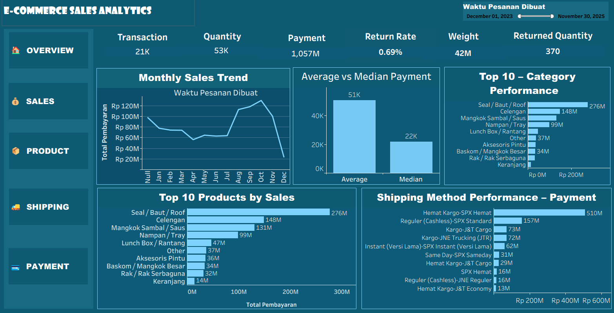

# 📊 E-Commerce Sales Analytics

An end-to-end Data Analytics project using an Indonesia e-commerce transaction dataset to evaluate data quality, analyze business performance, and transform transactional data into actionable insights through Python analysis and Tableau visualization.



---

## 🎯 Problem Statement

Raw e-commerce transaction data did not provide a clear and structured view of sales performance, product performance, payment, and returns.

This project addresses the problem by applying data quality validation, exploratory analysis, and business analysis using Python, then transforming the analysis results into an interactive Tableau dashboard to support performance monitoring and data-driven decision making.

---

## 🔄 Project Workflow

```text
Public E-Commerce Dataset
        ↓
Data Understanding
        ↓
Data Quality & Validation
        ↓
Missing Value & Date Validation
        ↓
Exploratory Data Analysis (EDA)
        ↓
Outlier Investigation
        ↓
Final Dataset (df_final)
        ↓
Business Performance Analysis
        ↓
KPI & Business Metrics
        ↓
Business Insights & Recommendations
        ↓
Tableau Data Visualization
        ↓
Interactive E-Commerce Sales Dashboard
```

---

## 🐍 Python Data Analysis

Python was used as the main tool for data understanding, validation, exploratory analysis, and business analysis.

### Python Workflow

```text
Load Dataset
     ↓
Data Understanding
     ↓
Data Quality Check
     ↓
Missing Value Analysis
     ↓
Duplicate & Identifier Validation
     ↓
Date/Time Validation
     ↓
Exploratory Data Analysis
     ↓
Outlier Investigation
     ↓
Dataset Finalization (df_final)
     ↓
Business Performance Analysis
     ↓
Business Insights & Recommendations
```

### Data Understanding & Quality

The dataset was examined to understand its structure, variables, transaction characteristics, and data quality.

| Area | Activities |
|---|---|
| Dataset Understanding | Structure, variables, and transaction characteristics |
| Missing Values | Missing value identification and business-context analysis |
| Duplicate Check | Duplicate row validation |
| Identifier Validation | Validation of transaction identifiers and `Order Id` |
| Date Validation | Validation of `Waktu Pesanan Dibuat` |
| Data Types | Validation of data types and data integrity |
| Outlier Investigation | Outlier detection and investigation using the IQR method |
| Dataset Finalization | Finalization of the dataset into `df_final` |

Missing values were evaluated based on business context rather than automatically removed.

---

## 🔎 Exploratory Data Analysis (EDA)

EDA was performed on the finalized dataset to understand the characteristics and patterns within the transaction data.

| Analysis Area | Description |
|---|---|
| Descriptive Statistics | Mean, median, quartiles, minimum, maximum, and standard deviation |
| Distribution Analysis | Distribution and skewness of transaction variables |
| Value Validation | Zero and negative value checks |
| Outlier Analysis | Investigation of extreme transactions using the IQR method |
| Correlation Analysis | Relationship between numerical variables |
| Categorical Analysis | Distribution of categorical variables |

Outliers were investigated based on transaction context rather than automatically treated as errors.

---

## 📈 Business Analysis

The analysis focuses on several key areas of e-commerce business performance.

### Key Performance Indicators

| KPI | Description |
|---|---|
| Total Transactions | Number of transactions |
| Total Quantity | Total units sold |
| Total Payment | Total transaction payment value |
| Total Discount | Total discount provided |
| Total Returned Quantity | Total quantity returned |
| Total Weight | Total weight of products |
| Return Rate | Percentage of quantity returned |

### Sales & Payment Analysis

| Analysis | Purpose |
|---|---|
| Monthly Sales Trend | Analyze sales/payment trends over time |
| Average vs Median Payment | Compare central tendency of transaction values |
| Transaction Value Distribution | Understand the distribution of payment values |
| Quantity & Payment Analysis | Evaluate relationships between sales volume and payment |
| Numerical Relationships | Analyze relationships between numerical variables |

### Product & Category Analysis

| Analysis | Purpose |
|---|---|
| Top 10 Products by Sales | Identify products with the highest sales contribution |
| Category Performance | Evaluate category-level sales performance |
| Quantity by Category | Compare sales volume across categories |
| Payment by Category | Compare payment contribution across categories |

### Return & Operational Analysis

| Analysis | Purpose |
|---|---|
| Returned Quantity | Measure the quantity of returned products |
| Return Rate | Evaluate overall return performance |
| Transactions with Returns | Identify transactions involving returns |
| Return Performance by Category | Compare return performance across categories |

### Shipping Analysis

| Analysis | Purpose |
|---|---|
| Shipping Method Performance | Evaluate payment performance by shipping method |
| Payment by Shipping Method | Compare transaction value across shipping methods |

---

## 📊 Key Business Metrics

The final analysis produced the following key metrics:

| Metric | Value |
|---|---:|
| Total Transactions | **20,848** |
| Total Quantity | **53,388** |
| Total Payment | **Rp1,056,651,631** |
| Total Discount | **Rp8,447,596** |
| Total Returned Quantity | **370** |
| Return Rate | **0.69%** |

---

## 💡 Key Business Insights

| Insight | Finding |
|---|---|
| Highest Payment Category | **Seal / Baut / Roof** generated the highest total payment, approximately **Rp275.99 million** |
| Highest Quantity Category | **Nampan / Tray** recorded the highest quantity, with **9,942 units** |
| Payment Distribution | Transaction payment values show a positively skewed distribution, indicating the presence of higher-value transactions |
| Strongest Relationship | `total_weight_gr` has the strongest Spearman relationship with `Total Pembayaran`, with a correlation of approximately **0.524** |
| Return Performance | **370 units** were returned from **53,388 units**, resulting in an overall return rate of approximately **0.69%** |
| Return Interpretation | Categories with high return rates should be evaluated together with transaction and quantity volume to avoid misleading conclusions from small samples |

---

## 🎯 Business Recommendations

Based on the results of the analysis, the following recommendations are proposed:

- **Maintain product availability** for categories with the highest payment contribution, particularly *Seal / Baut / Roof*, to support sustained sales performance.

- **Evaluate demand patterns and inventory planning** for high-volume products, particularly *Nampan / Tray*, to maintain product availability and support sales continuity.

- **Consider product weight (`total_weight_gr`) as an additional variable** in transaction value analysis and operational planning, given its strongest Spearman correlation with `Total Pembayaran`.

- **Conduct further evaluation of categories with high return rates** by considering transaction volume and product quantity, so that improvement priorities are not determined solely by return percentage.

- **Monitor key business indicators regularly**, including sales, payment, quantity, and returns, through the analytical dashboard to support performance evaluation and data-driven decision-making.

---

## 📊 Tableau Dashboard

The results from the Python analysis were transformed into an interactive Tableau dashboard for business monitoring and data visualization.

### Dashboard Components

| Component | Purpose |
|---|---|
| KPI Cards | Provide a quick overview of key business metrics |
| Monthly Sales Trend | Monitor sales/payment trends over time |
| Average vs Median Payment | Compare average and median transaction values |
| Top 10 Category Performance | Identify leading product categories |
| Top 10 Products by Sales | Identify products with the highest sales contribution |
| Shipping Method Performance | Compare payment performance by shipping method |
| Order Date Filter | Analyze dashboard metrics by selected date range |
| Navigation Sidebar | Provide structured dashboard navigation |

### Dashboard Preview


---

## 🧭 Dashboard Structure

The dashboard was designed with a structured navigation layout:

```text
Overview
   │
   ├── Sales
   │
   ├── Product
   │
   ├── Shipping
   │
   └── Payment
```

The dashboard combines KPI cards and business visualizations to provide a concise overview of e-commerce performance.

---

## 🛠️ Tools & Technologies

| Tool / Technology | Purpose |
|---|---|
| **Python** | Data analysis and preparation |
| **Pandas** | Data manipulation and analysis |
| **Jupyter Notebook** | Exploratory and business analysis |
| **Tableau** | Data visualization and dashboard development |
| **GitHub** | Project documentation and version control |

---

## 📚 Dataset

The project uses a publicly available Indonesia e-commerce transaction dataset.

The dataset was analyzed and validated before being used for exploratory analysis, business analysis, and Tableau visualization.

The final dataset was accepted for analysis with data quality notes. Missing values were retained when they represented valid or explainable conditions in the original dataset.

---

## 📌 Business Value

This project demonstrates how raw transactional data can be transformed into structured business information through:

```text
Raw Data
   ↓
Data Quality
   ↓
Data Analysis
   ↓
Business Insights
   ↓
Data Visualization
   ↓
Data-Driven Decision Making
```

The resulting dashboard can support:

- Sales performance monitoring
- Identification of high-performing products and categories
- Monthly sales evaluation
- Payment performance analysis
- Return monitoring
- Operational performance evaluation
- Data-driven business decision making

---

## 📁 Project Structure

```text
e-commerce-sales-analytics/
│
├── README.md
│
├── dataset/
│   └── all_months_clean.csv
│
├── notebook/
│   └── E-Commerce_Sales_Analysis.ipynb
│
├── tableau/
│   └── E-Commerce_Sales_Dashboard.twbx
│
└── images/
    └── E-Commerce_Sales_Dashboard.png
```

---

## 👩‍💻 Author

**Masniari Samosir, S.Kom., M.Kom.**

Master of Informatics Engineering – Data Science

---

## ⭐ Project Summary

This project demonstrates an end-to-end Data Analytics workflow, starting from data understanding and quality validation, followed by exploratory and business analysis using Python, and finally transforming the results into an interactive Tableau dashboard.

The project combines **data analysis, business understanding, KPI development, visualization, and data storytelling** to support data-driven decision making.
